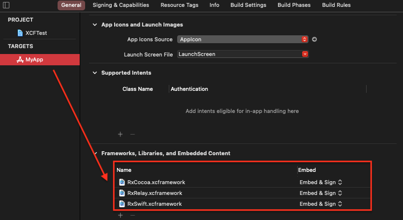

 RxSwift: ReactiveX for Swift
======================================

<!-- [](https://travis-ci.org/ReactiveX/RxSwift)   [](https://github.com/Carthage/Carthage) [](https://github.com/apple/swift-package-manager)  -->

[ReactiveX](http://reactivex.io/)（简写: Rx） 是一个可以帮助我们简化异步编程的框架。

[RxSwift] 是 [Rx](https://github.com/Reactive-Extensions/Rx.NET) 的 **Swift** 版本。

它尝试将原有的一些概念移植到 iOS/macOS 平台。

你可以在这里找到跨平台文档 [ReactiveX.io](http://reactivex.io/)。

KVO，异步操作 和 流 全部被统一成抽象序列。这就是为什么 Rx 会如此简单，优雅和强大。

## 操作

加入 [RxSwift](https://github.com/ReactiveX/RxSwift) **QQ** 交流群: **871293356**

[下载文档电子书](https://github.com/beeth0ven/RxSwift-Chinese-Documentation/releases/download/2.1.0/RxSwiftChineseDocumentation.epub)


## 文档更新日志

#### 22年5月6日（RxSwift 6）

* 更新文档以适配 RxSwift 6
* 加入 [ReplayRelay](content/recipes/rxrelay.md#replayrelay)
* 移除已过时的代码, 感谢 [@sheruce](https://github.com/sheruce), [@professordeng](https://github.com/professordeng), [@JPlay](https://github.com/JPlay)
* 纠正错别字，修改语病, 感谢 [@sheruce](https://github.com/sheruce), [@professordeng](https://github.com/professordeng)

  **[查看更多... ](CHANGELOG.md)**


## 示例

Github 搜索...


定义搜索结果 ...
```swift
let searchResults = searchBar.rx.text.orEmpty
    .throttle(.milliseconds(300), scheduler: MainScheduler.instance)
    .distinctUntilChanged()
    .flatMapLatest { query -> Observable<[Repository]> in
        if query.isEmpty {
            return .just([])
        }
        return searchGitHub(query)
            .catchAndReturn([])
    }
    .observe(on: MainScheduler.instance)
```

... 然后将结果绑定到 tableview 上

```swift
searchResults
    .bind(to: tableView.rx.items(cellIdentifier: "Cell")) {
        (index, repository: Repository, cell) in
        cell.textLabel?.text = repository.name
        cell.detailTextLabel?.text = repository.url
    }
    .disposed(by: disposeBag)
```

------

## 必备条件

* Xcode 12.x
* Swift 5.x

对于 Xcode 11 和以下版本，请使用 [RxSwift 5.x](https://github.com/ReactiveX/RxSwift/releases/tag/5.1.1)。

## 安装

安装 **RxSwift** 不需要任何第三方依赖。

以下是当前支持的安装方法：

### 手动

打开 Rx.xcworkspace, 选中 `RxExample` 并且点击运行。 此方法将构建所有内容并运行示例应用程序。

### [CocoaPods](https://guides.cocoapods.org/using/using-cocoapods.html)

```ruby
# Podfile
use_frameworks!

target 'YOUR_TARGET_NAME' do
    pod 'RxSwift', '6.5.0'
    pod 'RxCocoa', '6.5.0'
end

# RxTests 和 RxBlocking 将在单元/集成测试中起到重要作用
target 'YOUR_TESTING_TARGET' do
    pod 'RxBlocking', '6.5.0'
    pod 'RxTest', '6.5.0'
end
```

替换 `YOUR_TARGET_NAME` 然后在 `Podfile` 目录下, 终端输入：

```bash
$ pod install
```

### XCFrameworks

从 [RxSwift] 6 开始，每一次发布都会包括 `*.xcframework` 框架的二进制文件。

我们只用将所需框架的二进制文件拖入 `Targets/{APP}/General` 选项卡下的 **Frameworks, Libraries, and Embedded Content** 区域。



### [Carthage](https://github.com/Carthage/Carthage)

添加到 `Cartfile`

```
github "ReactiveX/RxSwift" "6.5.0"
```

```bash
$ carthage update
```

**[Carthage] 作为静态库。**

[Carthage] 会默认将 [RxSwift] 构建成动态库。

如果您希望使用 [Carthage] 将 [RxSwift] 构建为静态库，在使用 Carthage 构建之前，您可以使用以下脚本手动修改框架类型：

```bash
carthage update RxSwift --platform iOS --no-build
sed -i -e 's/MACH_O_TYPE = mh_dylib/MACH_O_TYPE = staticlib/g' Carthage/Checkouts/RxSwift/Rx.xcodeproj/project.pbxproj
carthage build RxSwift --platform iOS
```

### [Swift Package Manager](https://github.com/apple/swift-package-manager)

> 注意：在 Swift Package Manager 里面有一个关键的 `cross-dependency` bug，它影响了许多项目包括 [RxSwift]。我们已经在 2020 年早期提交了这个 [bug (SR-12303)](https://bugs.swift.org/browse/SR-12303)，但是目前还没有收到回复。[这里](https://github.com/ReactiveX/RxSwift/issues/2127#issuecomment-717830502)有一个临时的解决方案。

创建`Package.swift` 文件。

```swift
// swift-tools-version:5.0

import PackageDescription

let package = Package(
  name: "RxTestProject",
  dependencies: [
    .package(url: "https://github.com/ReactiveX/RxSwift.git", .exact("6.5.0"))
  ],
  targets: [
    .target(name: "RxTestProject", dependencies: ["RxSwift", "RxCocoa"])
  ]
)
```

```bash
$ swift build
```

如果构建或测试一个模块对 RxTest 存在依赖， 设置 `TEST=1`.

```bash
$ TEST=1 swift test
```

### 使用 git submodules 手动集成

* 添加 RxSwift 作为子模块

```bash
$ git submodule add git@github.com:ReactiveX/RxSwift.git
```

* 拖拽 `Rx.xcodeproj` 到项目中
* 前往 `Project > Targets > Build Phases > Link Binary With Libraries`, 点击 `+` 并且选中 `RxSwift`，`RxCocoa` 和 `RxRelay` 目标。


[RxSwift]:https://github.com/ReactiveX/RxSwift
[Carthage]:https://github.com/Carthage/Carthage